# `ABOUT.MD`
The [Home Assistant](http://home-assistant.io) _addon_ provides configuration and control for the [Ambianic Edge](http://ambianic.ai) entity detection and classification in images and videos using artificial intellience (AI).

## Step 1: Add repository
Add the _addon_'s Github [repository](http://github.com/dcmartin/hassio-addons) to the _Add-on store_, accessible from the _Supervisor_ (n.b. lower-left corner of the Home Assistant Web interface).

The Supervisor _Dashboard_ displays any installed _addons_ with indications for status and upgrade.

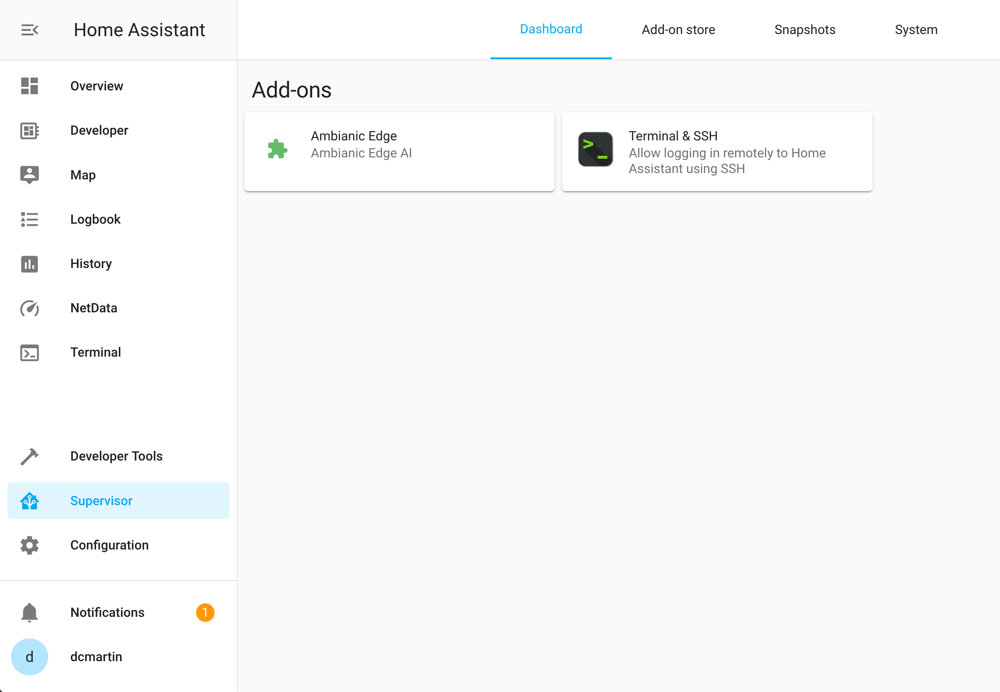

The Supervisor _Add-on store_ displays _addons_ available from configured repositories.

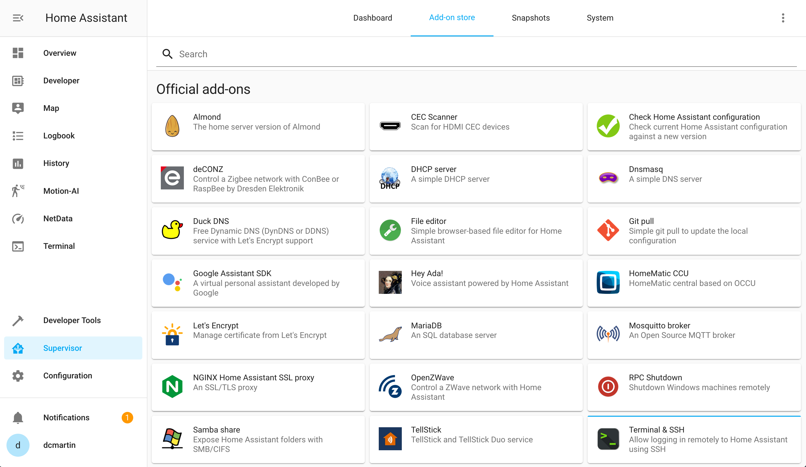

Additional repositories may be added (n.b control element, upper-right corner)

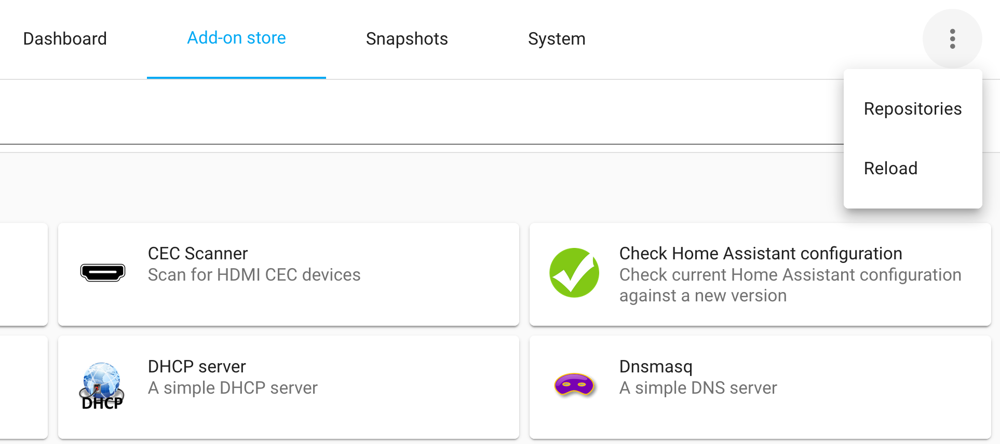

For example: `http://github.com/dcmartin/hassio-addons`

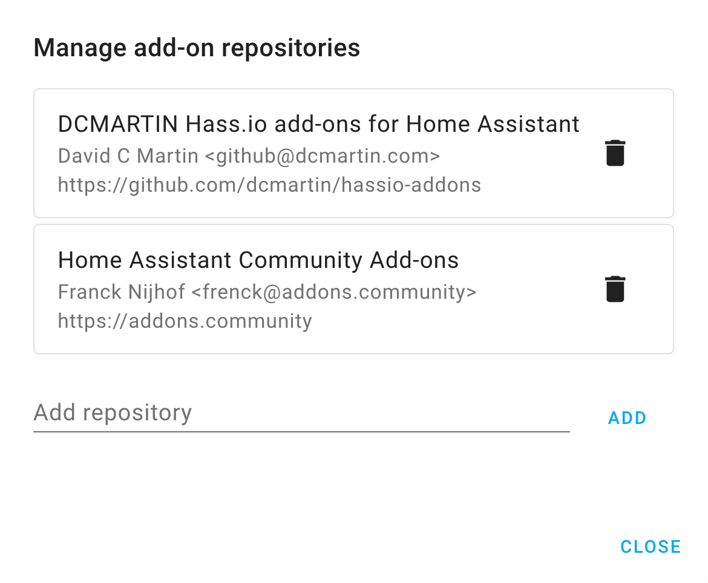

The _addons_ from the added repository are displayed in the _Add-on store_:

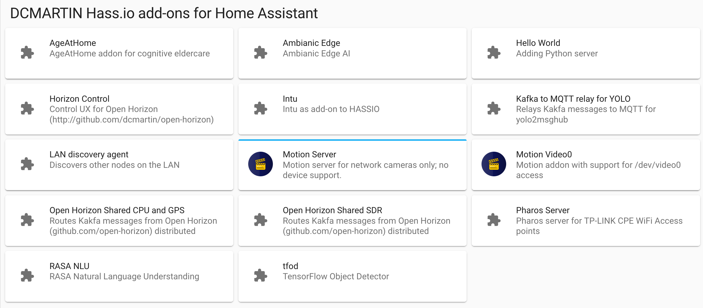

## Step 2: Install `ambianic`
Install the _addon_ and the Home Assistant supervisor will download the appropriate Docker container from [Docker Hub](http://hub.docker.com/); for example the [`armv7`](https://hub.docker.com/repository/docker/dcmartin/armv7-addon-ambianic) version for RaspberryPi.

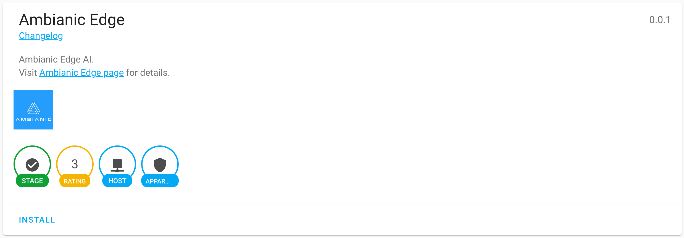

After installation -- which may require significant time depending on network speed -- the _addon_ should be configured with the _sources_ and other options and started.  See the [DOCS.md](../DOCS.md) file for more information on configuration options.

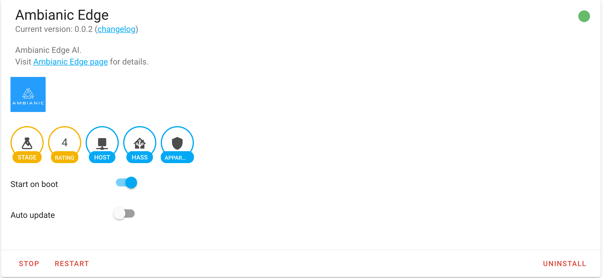

When an update to an _addon_ is available, a notification is provided.

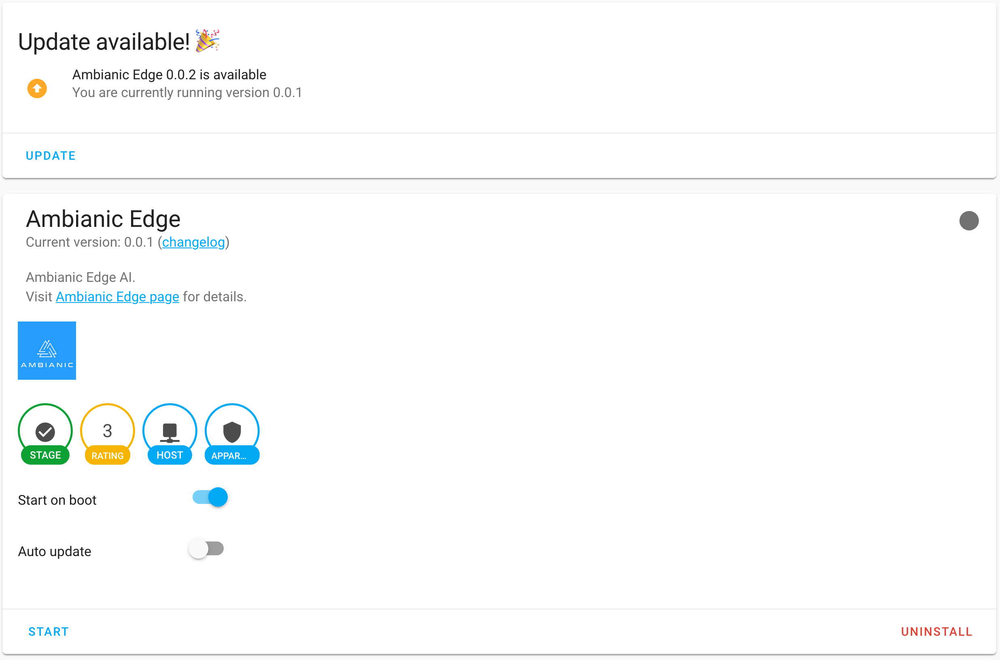

## Step 3: Browse to `ui.ambianic.ai`
The Ambianic Edge software communicates using `WebRTC` to a progressive Web application (PWA) that provides the user-interface.  The PWA provides for _settings_ to establish the peer-to-peer (P2P) connection between the edge device and the Web browser.

Using a Web browser, navigate to `https://ui.ambianic.ai` (**note**: `SSL/TLS`) and the PWA will load and provide access to the controls (n.b. on the left-side).

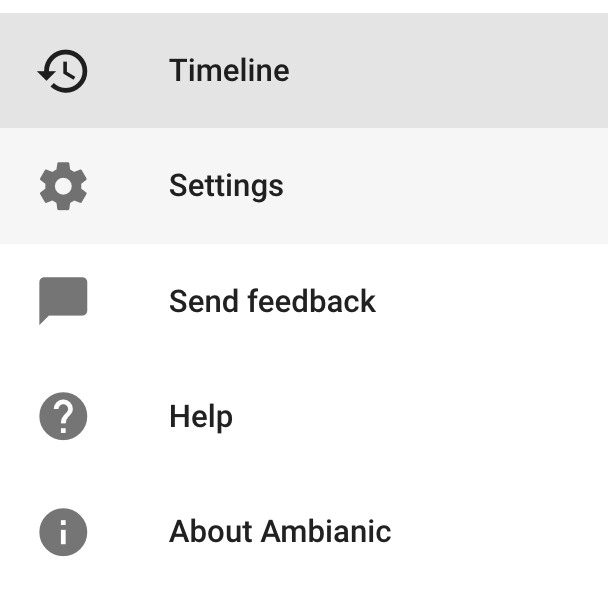

The PWA connects to the edge device through a redezvous on the local area network (LAN) requiring both the Web browser and the edge device to be on the same LAN for initiation.

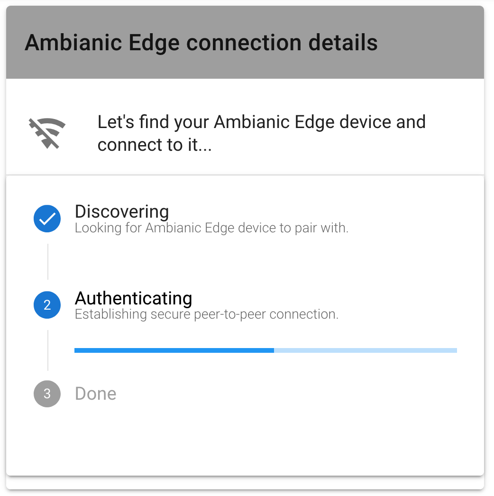

Once the P2P connection is established it will be maintained even when the Web browser is not on the same LAN.

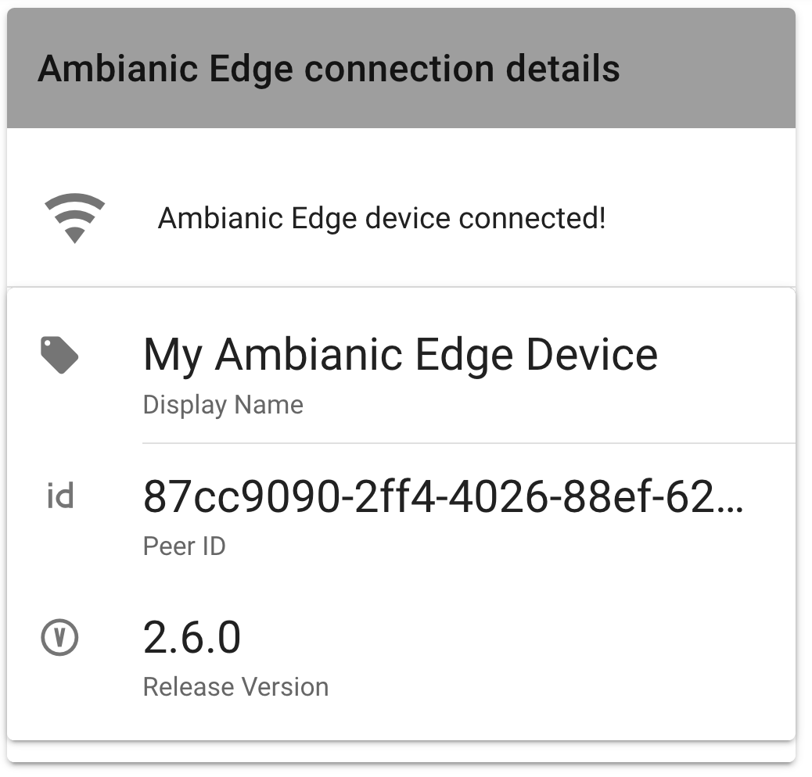

The PWA provides a _timeline_ of _events_, e.g. `Object Detection`, and displays them chronologically with the latest at the top.

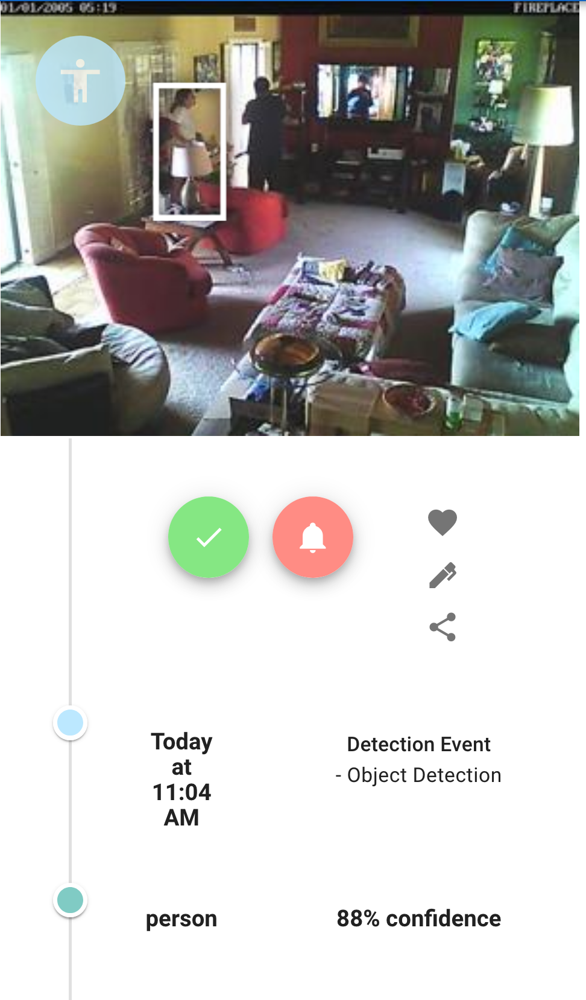

